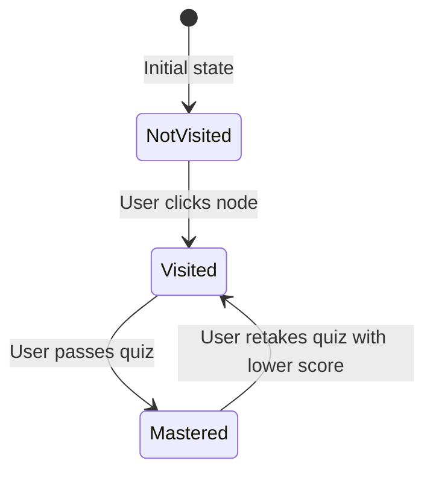

# Node Status Design Document

## Overview

The Node Status system enhances the existing visual representation of nodes in the knowledge graph by implementing a three-state visual progression system. Currently, nodes use a simple binary state (learned/unlearned) with basic color changes. This design expands that to a more nuanced system that clearly communicates user progress through visual cues.

The system builds upon the existing `learnedNodes` Set and uses local storage for persistence. Database integration will be handled as a separate feature.

## Architecture

### Current State Analysis

The existing system uses:
- `learnedNodes` Set stored in `window.persistentLearnedNodes` for client-side state
- Binary visual states: dimmed colors for unvisited, bright colors for visited
- Basic glow effects on visited nodes using CSS `drop-shadow` filters

### Enhanced State System

The new system introduces three distinct visual states:

1. **Not Visited** (Default): Dull/dimmed colors
2. **Visited** (In Progress): Bright colors without glow
3. **Mastered** (Completed): Bright colors with glow effect

### State Transitions



## Components and Interfaces

### Data Models

#### NodeStatus Interface
```typescript
interface NodeStatus {
  nodeId: string;
  status: 'not_visited' | 'visited' | 'mastered';
  lastUpdated: Date;
  quizScore?: number;
  passingGrade: number; // Default: 80%
}
```

#### Local Storage Integration
Node status will be persisted using browser localStorage:
- Extend existing `persistentLearnedNodes` pattern
- Store status data as JSON in localStorage
- Maintain backward compatibility with current system

### Visual Styling System

#### Color States
```typescript
interface NodeVisualState {
  baseColor: string;
  strokeColor: string;
  strokeWidth: number;
  glowEffect: string | null;
  opacity: number;
}
```

#### State Configurations
- **Not Visited**: Existing dimmed colors using `dimColor()` function
- **Visited**: Full brightness colors, stroke-width: 3px, no glow
- **Mastered**: Full brightness colors, stroke-width: 3px, glow effect using `drop-shadow`

### Service Layer

#### NodeStatusService
```typescript
class NodeStatusService {
  // Get current status for a node
  getNodeStatus(nodeId: string): NodeStatus;
  
  // Update node status (visited/mastered)
  updateNodeStatus(nodeId: string, status: NodeStatus): void;
  
  // Determine mastery based on quiz score
  calculateMasteryStatus(quizScore: number, passingGrade: number): 'visited' | 'mastered';
  
  // Save to localStorage
  saveToLocalStorage(): void;
  
  // Load from localStorage
  loadFromLocalStorage(): void;
}
```

## Data Models

### Client-Side State Management

#### Enhanced LearnedNodes System
Replace the current binary `learnedNodes` Set with a more sophisticated state management:

```typescript
// Current: Set<string>
// Enhanced: Map<string, NodeStatus>
let nodeStatusMap = new Map<string, NodeStatus>();
```

#### Persistence Strategy
- Maintain backward compatibility with existing `persistentLearnedNodes`
- Gradually migrate to `persistentNodeStatus` Map stored in localStorage
- Use JSON serialization for complex status data

## Error Handling

### Client-Side Resilience
- Graceful fallback to binary system if enhanced status unavailable
- Handle localStorage quota exceeded scenarios
- Graceful degradation if localStorage is unavailable

### Visual Rendering Errors
- Default to 'not_visited' state if status calculation fails
- Maintain existing visual system as fallback
- Log errors without breaking user experience

## Testing Strategy

### Unit Tests
- NodeStatusService methods
- Status calculation logic
- Visual state determination
- localStorage operations

### Integration Tests
- Node click → status update flow
- Quiz completion → mastery status flow
- localStorage persistence and retrieval
- Visual rendering with different states

### Visual Testing
- Screenshot comparisons for each state
- Glow effect rendering across browsers
- Color accuracy and accessibility
- Performance with large node counts

### User Acceptance Testing
- Clear visual distinction between states
- Intuitive progression understanding
- Performance impact assessment
- Cross-browser compatibility

## Implementation Considerations

### Performance Optimization
- Batch status updates to reduce localStorage writes
- Efficient visual updates using D3.js transitions
- Minimize DOM manipulation during state changes
- Cache status calculations

### Accessibility
- Ensure sufficient color contrast for all states
- Provide alternative indicators beyond color (stroke width, patterns)
- Screen reader compatibility for status information
- Keyboard navigation support

### Browser Compatibility
- CSS filter support for glow effects
- Fallback styling for older browsers
- Performance optimization for mobile devices
- Touch interaction considerations

### Migration Strategy
- Gradual rollout with feature flags
- Backward compatibility with existing data
- Data migration scripts for existing users
- Rollback plan if issues arise