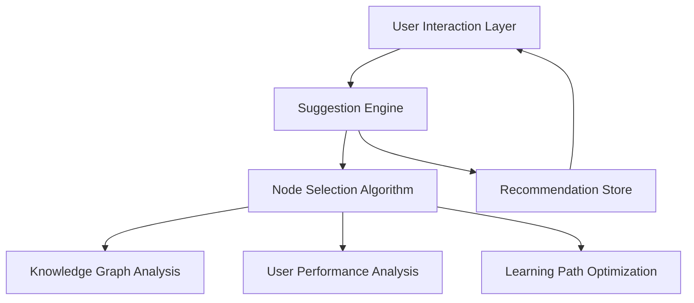

# Suggestion System Design Document

## Overview

The Suggestion System enhances the existing "Next Step" box by making it dynamic and responsive to user progress, quiz performance, and ELO bracket. Currently, the system uses a static recommendation set during onboarding, but this design will transform it into an intelligent recommendation engine that adapts to the user's learning journey.

The system will analyze the knowledge graph, user performance data, and learning patterns to suggest the most appropriate next node, optimizing for engagement and effective learning progression. This approach is inspired by matchmaking systems in competitive games like League of Legends, where the goal is to keep users in their optimal learning zone - challenged but not overwhelmed.

## Architecture

### Current State Analysis

The existing system uses:
- A simple Svelte store (`recommendedNodeStore`) that holds a single node recommendation
- Static recommendations based on onboarding quiz results (beginner/intermediate/advanced)
- No dynamic updates after the initial recommendation
- A "Next Step" UI component in the top-left corner of the app

### Enhanced Suggestion System Architecture

The new system will use a layered architecture:



### Core Components

1. **Suggestion Engine**: Central coordinator that triggers recommendations
2. **Node Selection Algorithm**: Core logic for selecting the next best node
3. **Knowledge Graph Analysis**: Analyzes node connections and dependencies
4. **User Performance Analysis**: Evaluates user quiz scores and interaction patterns
5. **Learning Path Optimization**: Ensures coherent learning progression
6. **Recommendation Store**: Enhanced version of the current store with history

## Components and Interfaces

### Data Models

#### UserProfile Interface
```typescript
interface UserProfile {
  eloRating: number;
  bracket: 'beginner' | 'intermediate' | 'advanced' | 'expert';
  quizHistory: QuizAttempt[];
  visitedNodes: Set<string>;
  masteredNodes: Set<string>;
  learningStreak: number;
  lastActive: Date;
}

interface QuizAttempt {
  nodeId: string;
  score: number;
  timestamp: Date;
  completionTime: number;
}
```

#### NodeRecommendation Interface
```typescript
interface NodeRecommendation {
  node: any; // Graph node object
  confidence: number; // How confident the system is about this recommendation (0-1)
  reason: RecommendationReason;
  timestamp: Date;
}

type RecommendationReason = 
  | 'next_in_path' 
  | 'prerequisite_needed' 
  | 'knowledge_gap' 
  | 'challenge_progression'
  | 'review_recommended';
```

### Service Layer

#### SuggestionService
```typescript
class SuggestionService {
  // Get current recommendation
  getCurrentRecommendation(): NodeRecommendation;
  
  // Generate a new recommendation based on user profile and graph
  generateRecommendation(userProfile: UserProfile, graph: any): NodeRecommendation;
  
  // Update recommendation after quiz completion
  updateAfterQuiz(nodeId: string, score: number): void;
  
  // Update recommendation after node visit
  updateAfterNodeVisit(nodeId: string): void;
  
  // Get recommendation history
  getRecommendationHistory(): NodeRecommendation[];
}
```

#### NodeSelectionAlgorithm
```typescript
class NodeSelectionAlgorithm {
  // Score each potential next node
  scoreNodes(userProfile: UserProfile, graph: any): Map<string, number>;
  
  // Find optimal next node based on scores and constraints
  selectOptimalNode(scores: Map<string, number>, constraints: SelectionConstraints): string;
  
  // Calculate difficulty match between user and node
  calculateDifficultyMatch(userElo: number, nodeDifficulty: number): number;
  
  // Determine if a node is within reach based on prerequisites
  isNodeWithinReach(nodeId: string, visitedNodes: Set<string>, graph: any): boolean;
}
```

### Store Layer

#### Enhanced RecommendedNodeStore
```typescript
// Enhanced store with history and metadata
const recommendedNodeStore = writable<NodeRecommendation | null>(null);
const recommendationHistoryStore = writable<NodeRecommendation[]>([]);

// Helper functions
function updateRecommendation(node: any, reason: RecommendationReason): void;
function getRecommendationHistory(): NodeRecommendation[];
function clearRecommendationHistory(): void;
```

## Data Flow

### Recommendation Generation Process

1. **Trigger Events**:
   - Application startup
   - Quiz completion
   - Node mastery achievement
   - Manual refresh request
   - Daily login (refresh stale recommendations)

2. **Data Collection**:
   - Retrieve user profile (ELO, visited nodes, quiz history)
   - Load knowledge graph structure
   - Analyze current learning context

3. **Candidate Selection**:
   - Identify connected nodes from current position
   - Filter by prerequisite requirements
   - Consider domain progression

4. **Scoring Algorithm**:
   - Score each candidate based on:
     - Difficulty match with user ELO
     - Relevance to current learning path
     - Prerequisite completion status
     - Domain diversity needs
     - Time since last visit (for review candidates)

5. **Final Selection**:
   - Apply weighting factors based on user's learning pattern
   - Select highest scoring node
   - Generate explanation for recommendation

6. **Presentation**:
   - Update recommendation store
   - Refresh UI components
   - Provide explanation tooltip

## Algorithm Design

### Node Scoring Formula

The core algorithm will score potential next nodes using a weighted formula:

```
Score = (DifficultyMatch × 0.4) + 
        (PathRelevance × 0.3) + 
        (PrerequisiteCompletion × 0.2) + 
        (DomainDiversity × 0.1)
```

Where:
- **DifficultyMatch**: How well the node difficulty matches user's current ELO
- **PathRelevance**: How relevant the node is to user's current learning path
- **PrerequisiteCompletion**: Percentage of prerequisites completed
- **DomainDiversity**: Bonus for exploring new domains when appropriate

### Difficulty Matching

The system will use a bell curve to match node difficulty to user ELO:

```
DifficultyMatch = 1 - abs(nodeDifficulty - userElo) / maxEloDifference
```

This creates a peak score when the difficulty perfectly matches the user's level, with diminishing scores as the difficulty diverges in either direction.

### Learning Path Coherence

To ensure coherent learning paths, the system will:
1. Prioritize direct connections to recently visited nodes
2. Favor nodes that build upon mastered concepts
3. Occasionally suggest review of foundational concepts
4. Avoid suggesting disconnected nodes unless for specific diversity goals

## UI/UX Design

### Enhanced Next Step Box

The current Next Step box will be enhanced with:
- Reason for recommendation (tooltip or small text)
- Confidence indicator (subtle visual cue)
- Option to request alternative recommendation
- Small icon indicating node type/domain

### Visual Mockup

```
┌─────────────────────────────────────────────┐
│ Next Step:  Neural Networks  [↻]            │
│ ↳ Recommended to build your foundation      │
└─────────────────────────────────────────────┘
```

Where:
- "Neural Networks" is the recommended node (clickable)
- [↻] is a refresh button to get alternative recommendation
- The second line explains why this node is recommended

## Error Handling

### Recommendation Failures

If the system cannot generate a good recommendation:
1. Fall back to simpler algorithms (e.g., just connected nodes)
2. Suggest popular nodes for the user's ELO bracket
3. Reuse previous successful recommendations
4. Log failure reasons for analysis

### Edge Cases

- **New Users**: Use onboarding quiz results to establish initial recommendations
- **Advanced Users**: Focus on challenging content and domain expansion
- **Inactive Users**: Suggest review of previously mastered content
- **Completion of Available Content**: Suggest revisiting difficult nodes or exploring new domains

## Testing Strategy

### Unit Tests

- Node scoring algorithm
- Difficulty matching function
- Prerequisite validation logic
- Recommendation generation pipeline

### Integration Tests

- End-to-end recommendation flow
- Store updates and UI rendering
- Quiz completion → recommendation update flow
- Node visit → recommendation update flow

### Simulation Testing

- Simulate various user profiles and learning paths
- Verify recommendation quality and diversity
- Test edge cases and recovery mechanisms
- Benchmark algorithm performance

## Implementation Considerations

### Performance Optimization

- Cache graph analysis results
- Precompute common recommendation paths
- Limit scoring to reasonable candidate set
- Batch update recommendations on significant events only

### Future Enhancements

> **IMPORTANT NOTE:** The initial implementation will use a simple state machine approach with localStorage for persistence. Future versions will:
> 1. Migrate all storage to Supabase for proper server-side persistence
> 2. Replace the rule-based algorithm with a machine learning model trained on user performance data
> 3. Implement more sophisticated recommendation strategies based on collected usage patterns
> 4. Replace the simple ELO bracket system with a true hidden MMR/ELO rating system for much finer granularity in skill assessment

These future enhancements are out of scope for the current implementation but should be considered in the design to ensure easy migration paths.

### Extensibility

- Design for future ML-based recommendation enhancements
- Support pluggable scoring algorithms
- Allow for A/B testing of recommendation strategies
- Prepare for social/collaborative recommendations

### Privacy and Data Usage

- Use only necessary user data for recommendations
- Clear explanation of how recommendations are generated
- Option to reset recommendation history
- No sharing of individual learning data